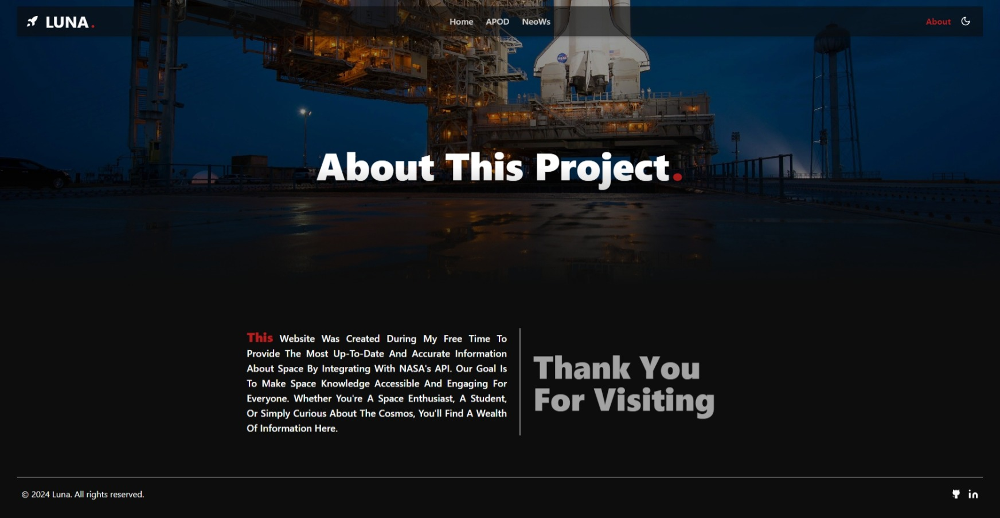

## 🌙 Luna

Luna is an interactive web application that visualizes space data with captivating visuals. This project was created to enhance web development skills and provide an engaging way to learn about space phenomena.


### 🌟 Features

#### Immersive Experience
- **Video Background:** The homepage features a stunning space-themed video background to create an immersive user experience.

#### NASA Astronomy Picture of the Day (APOD)
- **Daily APOD:** View NASA's Astronomy Picture of the Day, including details such as the title, explanation, and media type (image or video).
- **Date Selection:** Choose any date to view the APOD from that day.
- **Dynamic Background:** The background changes to complement the APOD, enhancing the visual experience.
- **Interactive Navigation:** Seamlessly navigate through  APODs within the last week.
- **High-Quality Visuals:** Enjoy high-resolution images and videos sourced from NASA.

#### Near-Earth Object Web Service (NeoWs)
- **Asteroid Data:** View data on near-Earth objects, including their close approach dates, velocities, and estimated diameters and more.
- **Detailed Information:** Get detailed information about potentially hazardous asteroids and their proximity to Earth.
- **Asteroid Visualization:** Visualize near-Earth objects to provide users with a clear understanding of their size.
- **Speed Visualization:** Display visual representations of object speeds to help users comprehend their velocity.
- **Date-Based Search:** Users can search for near-Earth object information by specifying a date range, similar to the APOD range feature.

#### Dark Mode
- **Dark Mode:** Toggle between light and dark modes for an optimal viewing experience in different lighting conditions.

#### Responsive Design
- **Fully Responsive:** The website is designed to be completely responsive, ensuring a seamless experience across all devices, including desktops, tablets, and mobile phones.

### 📦 Technologies Used
- **React:** A JavaScript library for building user interfaces.
- **Vite:** A build tool that provides a faster and leaner development experience.
- **Tailwind CSS:** A utility-first CSS framework for rapid UI development.
- **Shadcn:** A component library that enhances the UI with pre-built, customizable components.
- **Firebase:** A platform for building web and mobile applications, providing tools for authentication and database management.
- **Framer Motion:** A library for animations and interactions.
- **Axios:** A promise-based HTTP client for making API requests.
- **Zod:** A TypeScript-first schema declaration and validation library.

### 🚀 How to Run the Project
To run the project in your local environment, follow these steps:
1. Clone the repository to your local machine.
2. Run `npm install` in the project directory to install the required dependencies.
3. Create a `.env` file in the root directory and add your API keys:
   ```env
   VITE_NASA_API_KEY=your_nasa_api_key
   ```
4. Run `npm run dev` to start the development server.
5. Open [http://localhost:5173](http://localhost:5173) (or the address shown in your console) in your web browser to view the app.

### 🌐 APIs Used
- **NASA API:** Used to fetch images and data for the Astronomy Picture of the Day (APOD) and Near-Earth Objects (NeoWs).
- **Geolocation API:** Utilized for determining the user's location for potential additional features.

### 📚 Learning and Development
During the development of Luna, several key skills and concepts were learned and implemented:
- **React and State Management:** Mastered the use of React hooks like `useState` and `useEffect` for managing state and side effects.
- **Data Fetching with Axios:** Utilized Axios for making API requests and handling responses efficiently.
- **Styling with Tailwind CSS:** Gained proficiency in using Tailwind CSS for rapid and efficient styling.
- **UI Components with Shadcn:** Leveraged Shadcn to enhance the UI with customizable components.
- **Caching Data:** Implemented localStorage for caching API responses to improve performance and reduce redundant API calls.
- **Form Management:** Leveraged React Hook Form for managing form states and validations.
- **Animation and Interactivity:** Enhanced user experience with animations using Framer Motion.

### 🎥 Credits
- **Homepage Video:** The background video on the homepage is sourced from Pinterest.

### 💭 Future Improvements
- **Enhanced Details:** Add more detailed visualizations of asteroid characteristics, including size comparisons and orbital paths.
- **Interactive Features:** Implement interactive 3D models for asteroids to enhance user engagement and understanding.
- **Additional NASA API Services:** Expand integration with more NASA APIs, including DONKI, Earth observation data, EONET, EPIC, Exoplanet Archive, Open Science Data Repository, Insight Mars Weather Service API, and Mars Rover Photos.
- **Extended Navigation:** Add more navigation options, such as mouse wheel navigation for easier browsing.

### 🌌 Conclusion
Luna represents a blend of cutting-edge technology and a passion for space exploration, offering users an immersive journey through our universe. With ongoing improvements and new features planned, Luna continues to evolve as a captivating educational tool and a visual delight for astronomy enthusiasts.

## 🎥 A short demo

## Homepage 🏠


### APOD Hub 🌠


### NeoWs Data 📡


### About 📚

